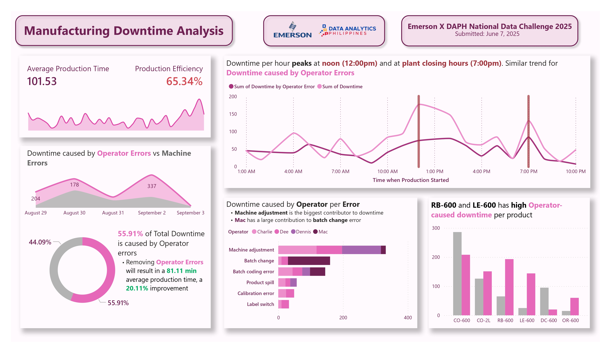
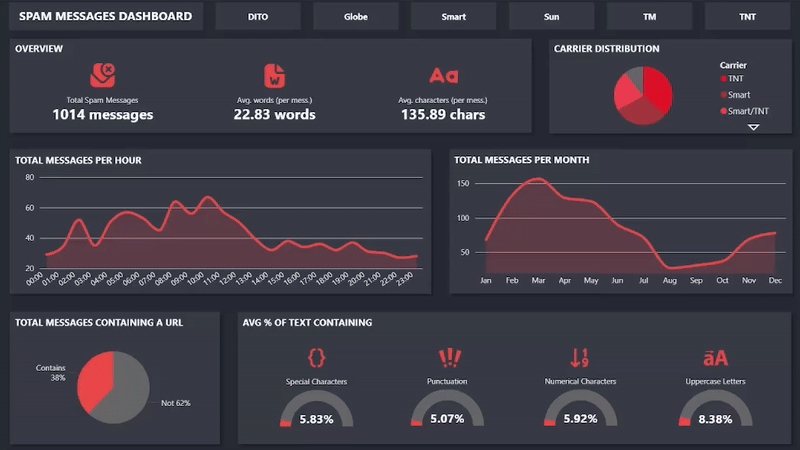
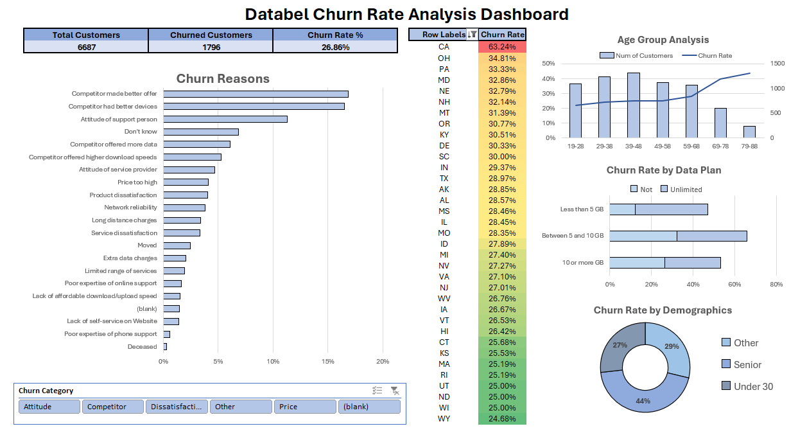

# 📞 **Contacts**
- 📱 **Phone:** +639 47 327 2187  
- 📧 **Email:** [**ramluismarmol.edu@gmail.com**](mailto:ramluismarmol.edu@gmail.com)  
- 💼 **LinkedIn:** [Ram Luis Marmol](https://www.linkedin.com/in/ram-luis-marmol-7b4b1b2a4/)  
- 🌐 **Facebook:** [Ram Luis Marmol](https://www.facebook.com/ramluissss)

---

# 🚀 **Projects**

## 🧩 **Northwind Traders** | [GitHub Repository](https://github.com/ramluislmarmol/northwind_traders)
  
- This project aims to analyze the famous **Northwind Traders** dataset using an multipage interactive **Power BI** dashboard connected to a **MySQL** database.  
- The goal of this project is to provide the top management for at-a-glance analysis of the current performance of the company — focusing on implementing slicers and multipage report.

---

## ⚙️ **Manufacturing Downtime** | [GitHub Repository](https://github.com/ramluislmarmol/soda_manufacturing_dashboard)
  
- This project aims create a **Power BI** report on the downtime analysis of a soda manufacturing production data.  
- With the goal of creating a "report" with **Exploratory Data Analysis (EDA)** instead of an interactive dashboard with slicers.  
- The target audience of this report is the **stakeholders** of the company who can make decisions based on the insights provided by the said report.

---

## 📱 **Spam Messages in PH** | [GitHub Repository](https://github.com/ramluislmarmol/spam_messages_analysis)
  
- This project aims on analyzing **spam messages** from various mobile carriers in the **Philippines** using an interactive dashboard.  
- It uses **MySQL** for database management and preliminary manipulation and **Power BI** for dynamic data visualization.  
- This project's goal is to inform the public of spam messages, giving them an overview on where the messages come from, whats inside them and the general trends of messages.

---

## 📊 **Databel Churn Analysis Dashboard** | [.xlsx file](https://docs.google.com/spreadsheets/d/1tlPVsxLdzfV8ovVwf7D0yUElDeCeH112/edit?usp=sharing&ouid=101272627821031792003&rtpof=true&sd=true)


---

## 🏍️ **Analyzing Motorcyle Part Sales** | [Queries](https://www.datacamp.com/datalab/w/09c538e2-93e6-4498-ba97-ec3e0b05e031)
Featured Query:
```
WITH aug_sales AS (
	SELECT
		*,
	    DENSE_RANK() OVER(PARTITION BY warehouse, month ORDER BY net_revenue DESC) AS rank_by_revenue
	FROM (
	    SELECT
		    payment, warehouse,
			CASE WHEN EXTRACT('month' from date) = 6 THEN 'June'
		         WHEN EXTRACT('month' from date) = 7 THEN 'July'
		         WHEN EXTRACT('month' from date) = 8 THEN 'August'
		    END as month,
			SUM(total) - SUM(payment_fee) AS net_revenue
    	FROM sales
		GROUP BY payment, warehouse, month
	) AS aggregated_sales
)
SELECT 
	warehouse, month, net_revenue, payment AS most_profitable_method
FROM aug_sales
WHERE rank_by_revenue = 1;
```
