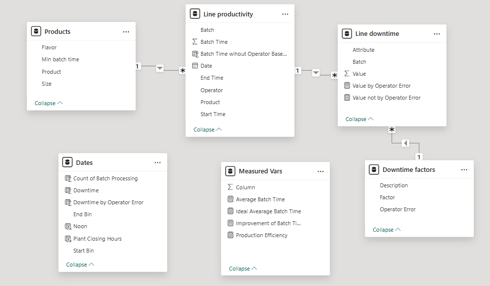
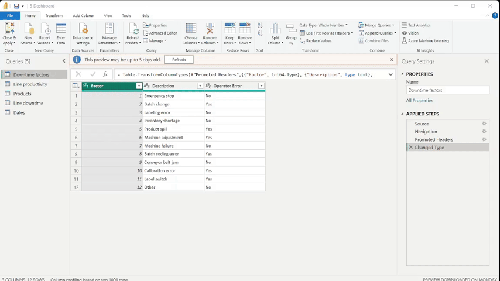
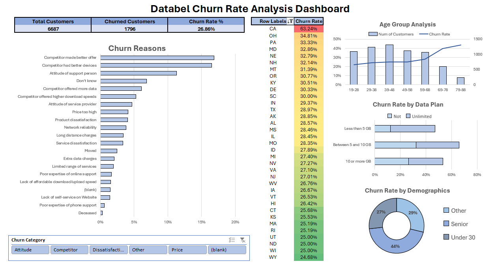
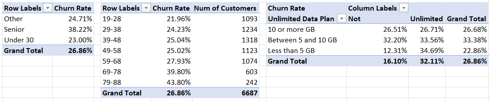

Welcome to my portfolio! First off, thank you, recruiter, for taking the time on reading my resume and checking my projects. I had to learn a bit of github to make this work and I hope this small website can prove myself as a suitable employee of your company. Cheers!

## **Soda Manufacturing Dashboard**
- **Power BI, Power Query**


[.pbix download](https://drive.google.com/file/d/1IEu6XZctxySeirTcSL8DIw_xzSxSjWXF/view?usp=drive_link)

- Designed and built an interactive Power BI dashboard for analyzing soda manufacturing efficiency. Used Power Query to transform messy data for optimal model performance.
- Incorporated diverse visualizations to highlight key operational insights, enhancing data accessibility and decision-making for production and operation managers. 
- My entry for the Emerson x DAPH National Data Challenge 2025 (results pending).

### Key Insights:
- 55.91% of Total Downtime is caused by Operator Errors. Removing these will result in an 81.11 average production time, a 20.11% improvement.
- Downtime per hour peaks at noon (12:00pm) and at closing hours (7:00pm) with a similar trend for operator-caused downtime.
- Machine adjustment accounts for the highest contribution for operator-caused downtime. Interestingly, Mac accounts for the highest contribution in batch change, but the lowest contribution to machine adjustment.
- RE-600 and LE-600 has noticeably high ratio of operator-caused downtime. OR-600 is also commendable. Whereas DC-600 has a high ratio of machine caused downtime.

### My Recommendations:
- Examine the area during the noon and closing hours to find the root cause of the spike. Possible causes may include but not limited to;
  - the rising Philippine temperature, making working conditions for laborers uncomfortable during noon,
  - “End of work” effect, where operators (anticipating the end of their shift) may psychologically disengage from tasks.
- Operator training to reduce the effect of man-made error. Machine adjustment training for Charlie, Dee and Dennis and batch change training for Mac is recommended. Adding standard operating procedures and kanban system may prove useful.
- Process inspection and study especially for RB-600 and LE-600 is recommended to help identify possible work errors. DC-600 machine inspection is also recommended.

### Data Model:


### Data Cleaning using Power Query:


### DAX Expressions used:

**Calculated Columns:**
```
Value not by Operator Error = 
  SUM('Line downtime'[Value]) - 
    CALCULATE(
      SUM('Line downtime'[Value]),
      FILTER('Downtime factors', 'Downtime factors'[Operator Error] = "Yes")
    )
```

**Calculated Measures:**
```
Production Efficiency = [Ideal Avearage Batch Time] / [Average Batch Time]
```

**Creating Time series and bins for analysis:**
```
Downtime = CALCULATE(
  SUM('Line downtime'[Value]),
    FILTER(
      'Line productivity', 
      'Line productivity'[Start Time] >= [Start Bin] && 'Line productivity'[Start Time] <= [End Bin]
    )
)
```
```
Downtime by Operator Error = CALCULATE(
  SUM('Line downtime'[Value]),
    FILTER(
      'Line productivity', 
      'Line productivity'[Start Time] >= [Start Bin] && 'Line productivity'[Start Time] <= [End Bin]
    ), FILTER (
      'Downtime factors',
      'Downtime factors'[Operator Error] = "Yes"
    )
)
```

## **Databel Churn Analysis Dashboard**
- **Microsoft Excel**



[.xlsx download](https://docs.google.com/spreadsheets/d/1tlPVsxLdzfV8ovVwf7D0yUElDeCeH112/edit?usp=sharing&ouid=101272627821031792003&rtpof=true&sd=true)

- Prepared and aggregated customer data in Microsoft Excel to identify key drivers of customer churn. 
- Developed a comprehensive Excel dashboard with dynamic charts, visualizing churn patterns and presenting actionable insights for retention strategies.

### Examples of Functions Used

**Nested If Statements**
```
=IF([@[Under 30]]="Yes", "Under 30", IF([@Senior]="Yes", "Senior", "Other"))
=IF([@[Avg Monthly GB Download]]<5, "Less than 5 GB", IF([@[Avg Monthly GB Download]]>10, "10 or more GB", "Between 5 and 10 GB"))
```

### Examples of PivotTables Created:



## **Analyzing Motorcyle Part Sales**
- **PostgreSQL**

[Queries are hosted in DataCamp](https://www.datacamp.com/datalab/w/09c538e2-93e6-4498-ba97-ec3e0b05e031/edit)

- Used PostgreSQL to create queries that obtain data from a fictional motorcycle company. Used data management techniques to clean and organize the data–before using more advanced functions to answer specific business questions.
- Communicated business concepts like net revenue, most profitable payment method, and most ordered motorcycle parts to create actionable insights, relevant to different departments in the company.

### Task 1:
The board of directors wants to gain a better understanding of wholesale revenue by product line, and how this varies month-to-month and across warehouses. You have been tasked with calculating net revenue for each product line and grouping results by month and warehouse. The results should be filtered so that only `"Wholesale"` orders are included. They have provided you with access to their database, which contains the following table called `sales`

**My Answer:**
```
SELECT 
  product_line,
  CASE WHEN EXTRACT('month' from date) = 6 THEN 'June'
       WHEN EXTRACT('month' from date) = 7 THEN 'July'
       WHEN EXTRACT('month' from date) = 8 THEN 'August'
  END as month,
  warehouse,
  SUM(total) - SUM(payment_fee) AS net_revenue
FROM sales
WHERE client_type = 'Wholesale'
GROUP BY product_line, warehouse, month
ORDER BY product_line, month, net_revenue DESC
```

### Task 2:
The finance team is exploring ways to reduce transaction costs and improve profitability. They’ve asked you to determine the most profitable payment method for each warehouse in each month. Calculate the net revenue for each payment method, grouped by warehouse and month, and identify the top payment method for each combination.

**My Answer:**
```
WITH aug_sales AS (
  SELECT
    *,
    DENSE_RANK() OVER(PARTITION BY warehouse, month ORDER BY net_revenue DESC) AS rank_by_revenue
    FROM (
      SELECT
        payment, warehouse,
        CASE WHEN EXTRACT('month' from date) = 6 THEN 'June'
          WHEN EXTRACT('month' from date) = 7 THEN 'July'
          WHEN EXTRACT('month' from date) = 8 THEN 'August'
          END as month,
        SUM(total) - SUM(payment_fee) AS net_revenue
      FROM sales
      GROUP BY payment, warehouse, month
    ) AS aggregated_sales
)
SELECT 
	warehouse, month, net_revenue, payment AS most_profitable_method
FROM aug_sales
WHERE rank_by_revenue = 1;
```

### Task 3:
The marketing team is planning a targeted campaign and wants to know the most popular product lines for retail and wholesale customers. They have given you the task to find the top 3 most ordered product lines for each client type.

**My Answer:**
```
WITH aug_sales AS (
  SELECT
    *,
    DENSE_RANK() OVER(PARTITION BY client_type ORDER BY amount_ordered DESC) AS rank_by_sales 
  FROM (
    SELECT
      client_type,
      product_line,
      SUM(quantity) AS amount_ordered
    FROM sales
    GROUP BY product_line, client_type
  ) AS summed_sales
)
SELECT *
FROM aug_sales
WHERE rank_by_sales IN (1, 2, 3);
```
